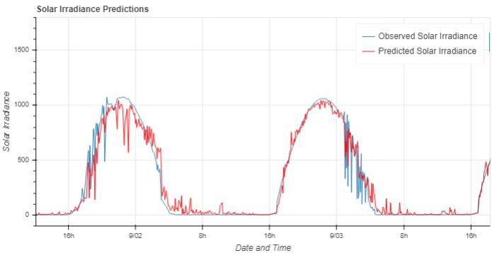
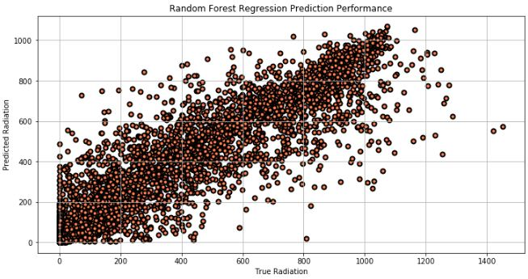

 # ML-Project-5-Solar-Irradiance

#### Project Goal

The goal of this project was to predict solar irradiance based on a variety of features such as; temperature, pressure, humidity, time, and wind directions.

#### Conclusion

The features that are the most relevant to solar irradiance was temperature(celsius) and day of the year. The random forest regressor was determined to be the best model which produced a mean R2 of 0.868 in cross validation. When comparing test set against the predictions; R2 score, MAE, and RMSE was 0.888, 54.6, and 106.2 was obtained. 

#### Data Source

NASA provided the dataset during the [Space Apps 2017's "You are my Sunshine" challenge](https://2017.spaceappschallenge.org/challenges/earth-and-us/you-are-my-sunshine), the dataset contains meteorological data from the HI-SEAS Habitat in **Hawaii**. 
  
#### Data Description

In particular the dataset includes observations of:

* Solar Irradiance (W/m2)
* Temperature (°F)
* Barometric Pressure (Hg)
* Humidity (%)
* Wind Direction (°)
* Wind Speed (mph)
* Sun Rise/Set Time

